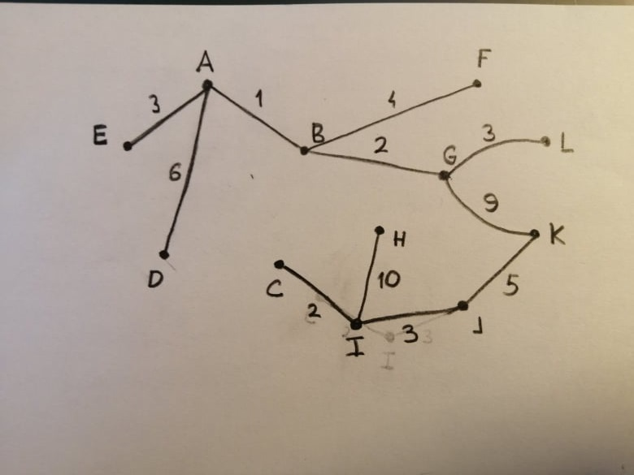
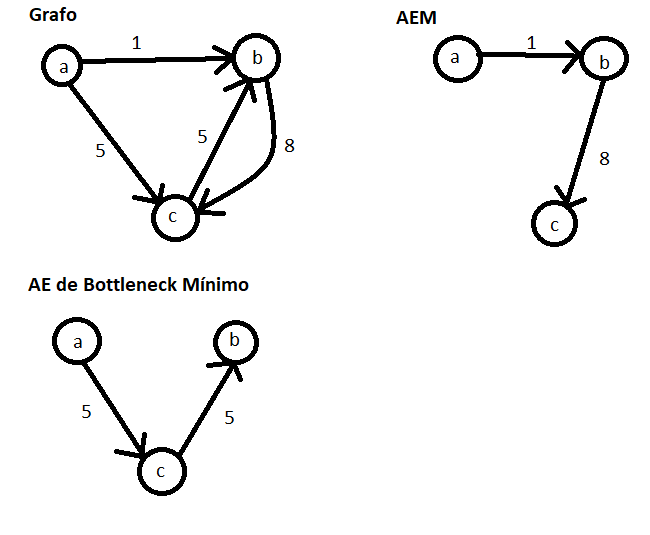
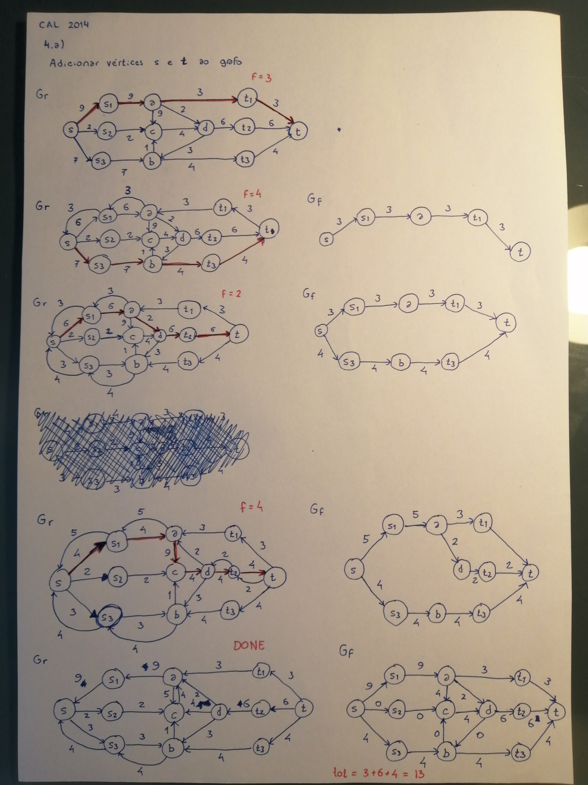
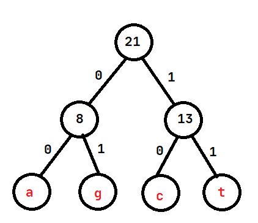

## Exame 2014

**1. a)**
```cpp
vector<int> bruteForce(const vector<int>& seq, int previous, int currentIdx) {
    if (currentIdx == seq.size()) {
        return vector<int>();
    }

    vector<int> taken;
    vector<int> notTaken;

    if (seq[currentIdx] > previous) {
        taken.push_back(seq[currentIdx]);

        vector<int> result = bruteForce(seq, seq[currentIdx], currentIdx + 1);
        taken.insert(taken.end(), result.begin(), result.end());
    }

    notTaken = bruteForce(seq, previous, currentIdx + 1);

    return taken.size() > notTaken.size() ? taken : notTaken;
}

vector<int> bruteForce(const vector<int>& seq) {
    return bruteForce(seq, INT_MIN, 0);
}
```
No algoritmo de força bruta sempre que encontramos um valor superior ao anterior, executamos o algoritmo recursivamente duas vezes (uma vez sem adicionar o valor à subsequência e uma vez onde este é adicionado). O algoritmo depois escolhe a maior subsequência das resultantes das chamadas recursivas. Podemos imaginar o algoritmo como uma árvore binária: cada vez que encontramos um valor que pode pertencer à subsequência, criamos dois novos ramos. Assim, podemos concluir que a complexidade temporal do algoritmo será `O(2^n)`.

**b)**
* s1, ..., sn - sequência
* li - comprimento da maior subsequência crescente de s1 até si
* pi - predecessor de si na maior subsequência crescente
* li = 1 + max {lk | 0 < k < i ^ sk < si} (max {} = 0)
* pi = k escolhido para o máximo na expressão de li
* Comprimento final: max(li)
* Subsequência final: reconstruída a partir de pi
```cpp
vector<int> dynamic(const vector<int>& seq) {
    vector<int> length;
    vector<int> previous;

    length.resize(seq.size());
    previous.resize(seq.size(), -1);

    for (int i = 0; i < seq.size(); ++i) {
        int max = 0;
        for (int k = 0; k < i; ++k) {
            if (seq[k] < seq[i] && length[k] > max) {
                max = length[k];
                previous[i] = k;
            }
        }
        length[i] = 1 + max;
    }

    vector<int> result;

    int idx = 0;

    for (int i = 0; i < length.size(); ++i) {
        if (length[i] > idx) {
            idx = i;
        }
    }

    while (idx != -1) {
        result.insert(seq.begin(), seq[idx]);
        idx = previous[idx];
    }

    return result;
}
```
Ao analisar a implementação com programação dinâmica, temos um for loop que percorre os valores de 0 a n - 1 e outro dentro desse que percorre os valores de 0 a i - 1. Como a reconstrução da subsequência é linear, podemos concluir que a complexidade temporal do algoritmo é `O(n^2)`.

**2. a)**

**Sequência de exploração dos nós:** 4, 2, 3, 6, 5, 1
d1|d2|d3|d4|d5|d6|p1|p2|p3|p4|p5|p6
-|-|-|-|-|-|-|-|-|-|-|-|
inf|inf|inf|0|inf|inf|null|null|null|null|null|null
20|5|inf|0|11|10|4|4|null|null|4|4
15|5|8|0|11|10|2|4|2|null|4|4
15|5|8|0|11|10|2|4|2|null|4|4
12|5|8|0|11|10|6|4|2|null|4|4
12|5|8|0|11|10|6|4|2|null|4|4
12|5|8|0|11|10|6|4|2|null|4|4

**Caminhos mais curtos desde o nó 4:**
* Nó 1: 4 - 6 - 1
* Nó 2: 4 - 2
* Nó 3: 4 - 2 - 3
* Nó 5: 4 - 5
* Nó 6: 4 - 5

**b)** O hashmap retornado pela função numPaths associa cada vértice do grafo ao número de caminhos possíveis para esse vértice a partir do nó v1
```
topologicalSort(G = (V, E)):
    for v in V:
        indegree(v) = 0
    for v in V:
        for w in adj(v):
            indregree(w) += 1
    
    C = Queue()

    for v in V:
        if indegree(v) == 0:
            C.push(v)
    
    T = List()

    while not C.empty():
        v = C.pop()
        T.push_back(v)

        for w in adj(v):
            indegree(w) -= 1
            if indegree(w) == 0:
                C.push(w)
    
    if T.size() != V.size():
        fail("Graph has cycles")
    
    return T

numPaths(G = (V, E), v1):
    T = topologicalSort(G)

    H = HashMap()

    for v in V:
        H[v] = 0

    H[v1] = 1
    
    idx = T.find(v1)

    for i in range(idx, T.size()):
        for w in adj(T[i]):
            H[w] += H[i]
    
    return H
```

**3. a)** O conjunto de arestas que minimizam o custo pode ser obtido através de um algoritmo que calcule a árvore de expansão mínima, como, por exemplo, algoritmo de Prim. Usando este algoritmo, começando pelo nó A, obtemos a árvore:



O custo do projeto será 48.

**b)**
```
TODO
```
**c)** Não. Considerando o seguinte grafo, por exemplo, podemos ver que a árvore de expansão de bottleneck mínimo tem peso 10, o que é maior que o peso da árvore de expansão mínima (9), logo esta não pode ser uma árvore de expansão mínima.



**4. a)** O fluxo máximo através da rede é 13.



**b)**
```
S = {S1, S2, S3, A, B, C, D}  
T = {T1, T2, T3}
```
**c)** Se a aresta {c, d} não pudesse ser utilizada, o quarto caminho de aumento da alínea a) não existiria. De facto, nesse passo não existiriam mais caminhos de aumento pelo que o fluxo total seria apenas 9.

**5.** A sequência não pode ser uma possível codificação da mensagem segundo o algoritmo de Huffman. Como demonstra o exemplo, quando o algoritmo é aplicado à mensagem, os quatro caracteres ficam codificados com uma combinação de tamanho 2 bits. Na sequência apresentada, 3 bits são utilizados para o caracter 'a' e 1 bit para o caracter 'c', por exemplo.



Caracter|Frequência|Codificação
|-|-|-
a|3|00
c|7|10
t|6|11
g|5|01

❓ **6. a)** Podemos reformular este problema como um problema de "coloração k" de vértices. Primeiro, criamos um grafo com um nó por cada transmissor e, para cada par de transmissores que poderão causar interferência, criamos uma aresta a ligar os nós que correspondem a esses transmissores. Finalmente, cada frequência corresponde a uma cor diferente, sendo k igual ao número de frequências. É também necessário adicionar uma restrição que impede a atribuição de uma cor (frequência) a um nó (transmissor) que não esteja no conjunto de frequências do transmissor.  
❓ **b)** Podemos reduzir o problema da atribuição de frequências ao problema de "coloração k" de vértices em tempo polinomial. Algoritmo em pseudocódigo:
```
Convert(listTr, pairs):
    G <- EmptyGraph()

    for tr in listTr:
        G.addVertex(tr)
    
    for pair in pairs:
        G.addEdge(pair.tr1, pair.tr2)
    
    return G
```
Como o problema de "coloração k" de vértices pertence à classe NP, podemos concluir que o problema de atribuição de frequências também será NP, pelo que não existe um algoritmo que o resolva em tempo polinomial.