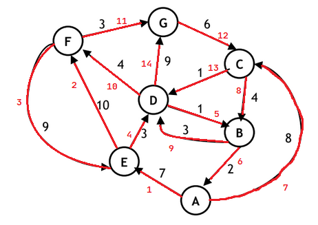
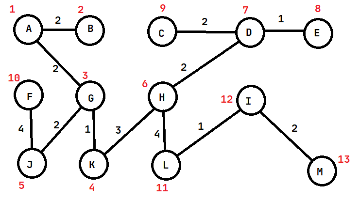
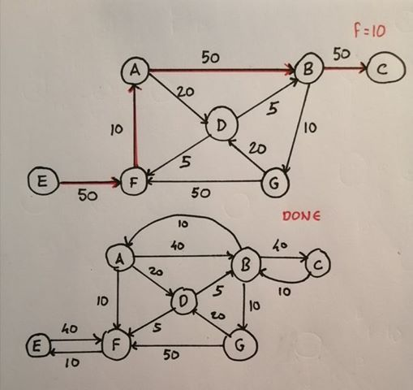
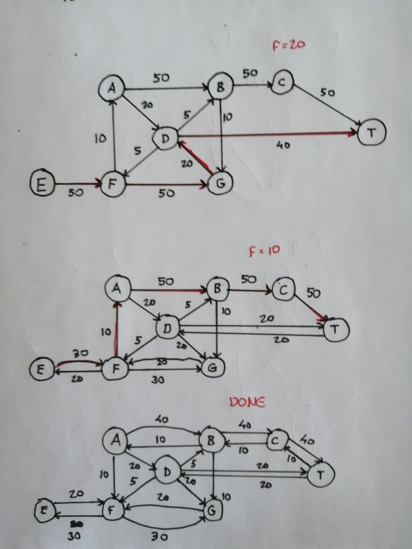
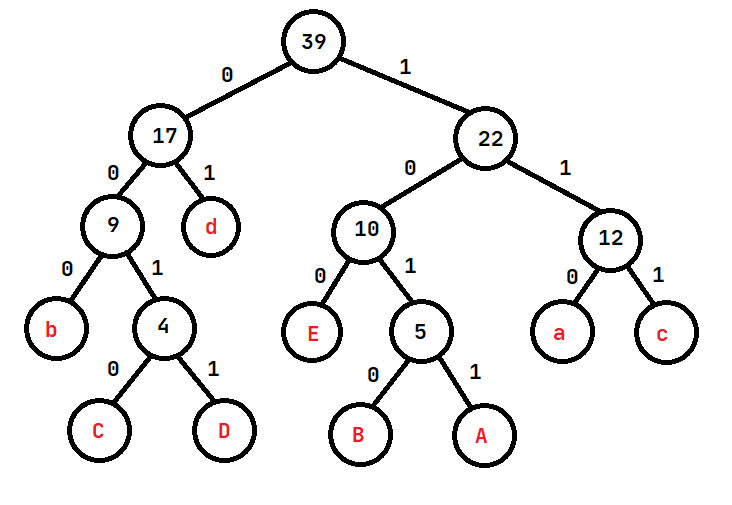

## Exame 2016

**1. a)**
```cpp
int greedy(const vector<int>& pos, const vector<int>& valor) {
    int totalValue = 0;
    int lastPlaced;

    for (int i = 0; i < pos.size(); ++i) {
        if (i == 0 || pos[i] - pos[lastPlaced] >= 5) {
            totalValue += valor[i];
            lastPlaced = i;
        }
    }

    return totalValue;
}
```
A complexidade temporal do algoritmo ganancioso é `O(n)`. O algoritmo não é ótimo visto que tenta incluir um cartaz sempre que puder, em vez de colocar os cartazes nos sítios que conduzem ao valor máximo.

**b)**
* Dados
    * Distância dos local i até ao fim do troço - vetor `pos[i]`
    * Valor do cartaz no local i - vetor `valor[i]`
    * Local mais próximo que está a uma distância maior ou igual a 5 km do local j - vetor `e[j]`
* Variáveis de condição
    * vetor `s[i]`: maior valor possível considerando locais até ao local i
* Função objetivo
    * Maximizar `sum(valor[i] for i in locais)`
* Restrição
    * `pos[i] - pos[i - 1] >= 5 for i in range(1, locais.size())`

```cpp
int dynamic(const vector<int>& pos, const vector<int>& valor) {
    vector<int> s(pos.size());

    int threshold;

    for (int i = 0; i < pos.size(); ++i) {
        s[i] = valor[i];
        threshold = max(0, pos[i] - 5);

        for (int j = 0; j < i; ++j) {
            if (pos[j] <= threshold) {
                s[i] = max(s[i], s[j] + valor[i]);
            }
            else {
                s[i] = max(s[i], s[j]);
            }
        }
    }

    return s[pos.size() - 1];
}
```

A complexidade da solução é `O(n^2)`, e garante uma solução ótima. O vetor `s[i]`, como está definido na formalização do problema, contém o lucro máximo considerando apenas os locais até ao local i. Os índices menores que i são utilizados para calcular o valor de i, tendo em conta as distâncias entre cartazes (se a distância for menor que `threshold`, o cartaz i é considerado, senão não é). Deste modo ficamos com o lucro máximo considerando as várias possiblidades. 

**2. a)** Usando o algoritmo de Dijkstra, temos a seguinte sequência de exploração de vértices:

Vértice explorado|dA|dB|dC|dD|dE|dF|dG|pA|pB|pC|pD|pE|pF|pG
-|-|-|-|-|-|-|-|-|-|-|-|-|-|-
nenhum|0|inf|inf|inf|inf|inf|inf|NULL|NULL|NULL|NULL|NULL|NULL|NULL
A|0|inf|8|inf|7|inf|inf|NULL|NULL|A|NULL|A|NULL|NULL
E|0|inf|8|10|7|17|inf|NULL|NULL|A|E|A|E|NULL
C|0|12|8|9|7|17|inf|NULL|C|A|C|A|E|NULL
D|0|10|8|9|7|13|18|NULL|D|A|C|A|D|D
B|0|10|8|9|7|13|18|NULL|D|A|C|A|D|D
F|0|10|8|9|7|13|16|NULL|D|A|C|A|D|F
G|0|10|8|9|7|13|16|NULL|D|A|C|A|D|F

Logo o caminho mais curto de A para G é `A -> C -> D -> F -> G`, de peso 16.

**b)** 

**c)** Estamos à procura de um caminho de Euler. Para este existir, o grafo deve ser fortemente conexo e cada vértice deve ter o mesmo grau de entrada e saída **ou** todos os vértices menos dois têm o mesmo grau de entrada e saída, sendo que a diferença dos graus nesses dois vértices deve ser 1 e esses dois vértices serão o ínicio e o fim do caminho.  
Analisando o grafo, percebemos facilmente que este é fortemente conexo, isto é, podemos atingir qualquer outro vértice a partir de qualquer vértice.  
Quanto aos graus de entrada e saída dos vértices temos:

Vértice|Grau de entrada|Grau de saída
-|-|-
A|1|2
B|2|2
C|2|2
D|3|3
E|2|2
F|2|2
G|2|1

Podemos ver que todos os vértices exceto A e G têm graus de entrada e saída iguais, e nos vértices A e G estes diferem apenas em 1. Logo existe um caminho de Euler começando em A e acabando em G. Os números a vermelho mostram a ordem de exploração das arestas:



**3. a)** Usando o algoritmo de Prim, começando no vértice A, este algoritmo mantém uma lista dos vértices conhecidos. Em cada passo do algoritmo, adiciona a aresta de menor peso que liga um vértice conhecido a um desconhecido. Ficamos com a seguinte árvore de expansão mínima (os vértices a vermelho mostram a ordem de exploração dos vértices):



**b)**  

**4. a)** O fluxo máximo é de 10000 uv, pelo que a rede não consegue transportar o volume desejado.



**b)** Permanece igual, visto que apenas 10000 uv conseguem atravessar o troço FA e atingir qualquer um dos consumidores.

**c)** O fluxo máximo passa a ser 30000 uv.



**5. a)** Usando um código de tamanho fixo, o número de bits mínimo é dado pela expressão `ceil(log2(N))` onde N é o número de caracteres distintos na string. Como na string dada existem 9 caracteres distintos (`a, A, b, B, c, C, d, D, E`), 3 bits não seria suficiente para fazer a codificação. Seria necessário um código de `ceil(log2(9)) = 4` bits.  
**b)** A tabela de frequências do texto é:

Caracter|Frequência|Codificação binária
-|-|-
a|7|110
A|3|1011
b|5|000
B|2|1010
c|5|111
C|2|0010
d|8|01
D|2|0011
E|5|100

Usando o algoritmo de Huffman obtemos a seguinte árvore:



Logo o custo mínimo da codificação será
```
(3 x 7) + (4 x 3) + (3 x 5) + (4 x 2) + (3 x 5) + (4 x 2) + (2 x 8) + (4 x 2) + (3 x 5)
= 21 + 12 + 15 + 8 + 15 + 8 + 16 + 8 + 15
= 118 bits
```

**c)** 

* Código de tamanho fixo: `39 x 4 = 156 bits`
* Código de tamaho variável: `118 bits`
* RLE: `32 bytes = 256 bits` (ASCII de 8 bits) ❓
    * String em RLE: `5a3b2C5d5E2D1d3A1a1b1c2d1b1a2B4c`

Logo o melhor método é a codificação de tamanho variável.

**6. a)** 