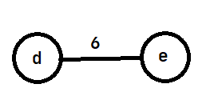
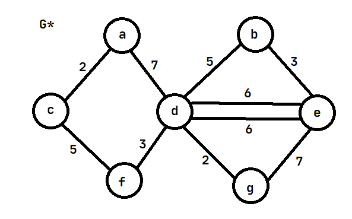
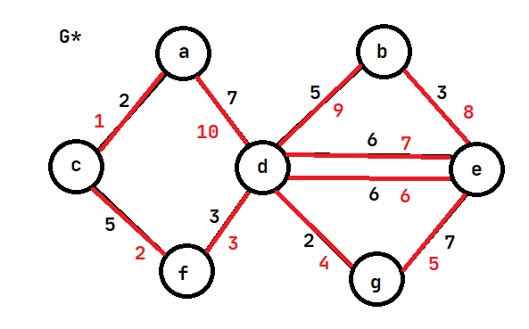
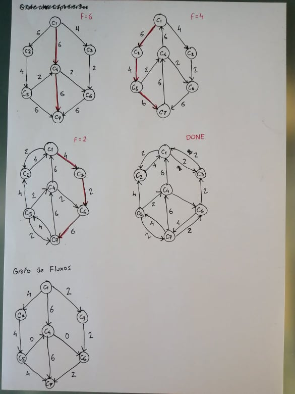
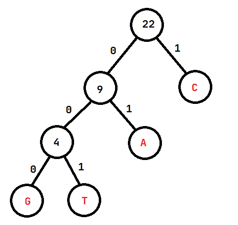

## Exame 2017

**1. a)**
**b)**

**2. a)** A tabela seguinte apresenta as distâncias e caminhos calculados com o algoritmo de Dijkstra:
Vértice processado|dA|dB|dC|dD|dE|dF|dG|pA|pB|pC|pD|pE|pF|pG
-|-|-|-|-|-|-|-|-|-|-|-|-|-|-|
nenhum|0|inf|inf|inf|inf|inf|inf|NULL|NULL|NULL|NULL|NULL|NULL|NULL
A|0|1|3|inf|inf|10|inf|NULL|A|A|NULL|NULL|A|NULL
B|0|1|2|8|6|10|3|NULL|A|B|B|B|A|B
C|0|1|2|8|5|10|3|NULL|A|B|B|C|A|B
G|0|1|2|8|5|10|3|NULL|A|B|B|C|A|B
E|0|1|2|7|5|7|3|NULL|A|B|E|C|E|B
D|0|1|2|7|5|7|3|NULL|A|B|E|C|E|B
F|0|1|2|7|5|7|3|NULL|A|B|E|C|E|B

Caminho mais curto de A até F: `A-> B -> C -> E -> F`, de peso 7.

**b)** Em pseudocódigo:
```
dijkstra(G = (V, E), s):
    for v in V:
        dist(v) = infinite
        path(v) = NULL
    
    dist(s) = 0
    Q = MinPriorityQueue()
    Q.insert(s, 0)

    while not Q.empty():
        v = Q.extract_min()
        for w in adj(v):
            if dist(w) > dist(v) + weight(v, w):
                dist(w) = dist(v) + weight(v, w)
                path(w) = v
                if Q.contains(w):
                    Q.decrease_key(w, dist(w))
                else:
                    Q.insert(w, dist(w))

reconstructPath(G, v):
    P = Vector()

    P.insert_begin(v)

    v = path(v)
    while (v != NULL):
        P.insert_begin(v)
        v = path(v)
    
    return P

shortestWithVertex(G, vi, vf, vk):
    dijkstra(G, vi)
    P1 = reconstructPath(G, vk)

    dijkstra(G, vk)
    P2 = reconstructPath(G, vf)

    for i in range(1, P2.size()):
        // Ignore first vertex so we don't repeat vk
        P1.insert_end(P2[i])

    return P1
```

O algoritmo apresentado chama o algoritmo de Dijkstra duas vezes, uma vez para determinar o caminho mais curto de vi a vk e outra vez para determinar o caminho mais curto de vk a vf, concatenando os dois caminhos obtidos para obter o caminho mais curto de vi a vf que passa por vk.

**3. a)** O único ponto de articulação do grafo é o vértice D: se este vértice for removido, é impossível atingir os vértices A, C ou F a partir dos vértices B, E ou G e vice-versa, ou seja, o grafo passa a ser desconexo.  
**b)** Os passos do algoritmo do percurso ótimo do Carteiro Chinês são:
* Achar todos os vértices de grau ímpar (deve existir um número par destes vértices).
```
A: grau 2
B: grau 2
C: grau 2
D: grau 5 ✔️
E: grau 3 ✔️
F: grau 2
G: grau 2

2 vértices de grau ímpar: D e E
```
* Achar os caminhos mais curtos entre os pares de vértices de grau ímpar. Como só há dois destes vértices é bastante fácil executar este passo manualmente:
```
Caminho mais curto de D para E:
D -> E (peso 6)

Caminho mais curto de E para D:
E -> D (peso 6)
```
* Construir um grafo completo G' com os vértices de grau ímpar ligados com arestas de peso igual ao dos caminhos mais curtos calculados anteriormente


* Emparelhar os vértices de G' minimizando a soma das distâncias entre os vértices (o melhor e único emparelhamento é D com E)
* Por cada par, adicionar arestas duplicadas a G de peso igual ao caminho mais curto. Seja G* o grafo resultante


* Encontrar um circuito de Euler em G*. Os números a vermelho são a ordem de visita das arestas



TODO: Explicar porque é que é um caminho ótimo do Carteiro Chinês

**4. a)** Para determinar se a rede é capaz de suportar o número previsto de viagens, primeiro convertemos o número de vias no grafo em valores de volume horário (milhares de carros por hora). Depois basta calcular o fluxo máximo na rede, usando, por exemplo, o algoritmo de Edmonds-Karp:



O fluxo máximo na rede é 12000 veículos por hora, pelo que esta não consegue suportar o número previsto de viagens.

**b)** Os troços `C1 -> C4` e `C4 -> C7` seriam os mais rentáveis visto que têm o maior valor de fluxo (6000 veículos por hora).

**5. a)** Usando codificação de tamanho fixo, o tamanho mínimo do código é dado pela expressão `ceil(log2(N))`. Neste caso, como o alfabeto tem 4 caracteres, o tamanho será `ceil(log2(4)) = 2` bits.  
Logo, para codificar o gene XPTO serão necessários `22 * 2 = 44` bits.

**b)** 
Caracter|Frequência|Codificação binária
-|-|-
A|5|01
C|13|1
G|2|000
T|2|001
A codificação variável de tamanho total mínimo é obtida através do algoritmo de Huffman. Usando o algoritmo, obtemos a seguinte árvore:



Logo o custo total de codificação da string será:
```
5 * 2 + 13 * 1 + 2 * 3 + 2 * 3
= 10 + 13 + 6 + 6
= 35 bits
```

**6. a)** Dados uma lista de estudantes e os cursos em que estes estão inscritos e um inteiro k, é possível marcar os exames dos cursos em k ou menos slots de uma hora, de forma a que nenhum dos estudantes tenha exames sobrepostos?  
**b)** Uma possível marcação de exames pode ser verificada em tempo polinomial: basta percorrer a lista de cursos de cada estudante e verificar que não existem dois exames durante a mesma hora. Logo o problema é NP.  
Podemos reduzir o problema da coloração de grafos ao problema da marcação de exames em tempo polinomial usando o seguinte processo:

* Criamos um grafo em que cada vértice representa um curso e cada aresta significa que um estudante está inscrito nos dois cursos correspondentes
* Uma solução do problema da coloração do grafo corresponde a uma solução do problema de marcação de exames: cada cor representa um slot de uma hora. Se conseguirmos colorir o grafo com k ou menos cores garantindo que nenhuma aresta tem vértices da mesma cor, teremos uma marcação em que nenhum estudante tem dois exames marcados à mesma hora

Assim, podemos concluir que o problema de marcação de exames é NP-completo, já que o problema de coloração de grafos é NP-completo.