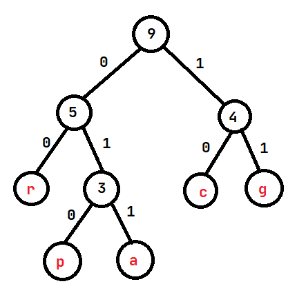

## Exame 2014 - Recurso

**2. a)** Visita em profundidade: A, B, C, E, F, D
Visita em largura: A, B, D, E, C, F  
**b)** Como as arestas do grafo são pesadas, é recomendado utilizar o algoritmo de Dijkstra. O primeiro passo é passar o grafo de não dirigido para dirigido. Por cada aresta no grafo não dirigido, adicionamos um par de arestas simétricas com o peso da aresta. Depois, podemos aplicar o algoritmo de Dijkstra, selecionando como vértice inicial o vértice A.

Uma possível ordem do processamento dos vértices é a seguinte (podem existir várias ordens devido a empates na fila de prioridade): `A, B, C, D, E, F`

**Tabela com os valores das distâncias e caminhos:**
dA|dB|dC|dD|dE|dF|pA|pB|pC|pD|pE|pF
--|--|--|--|--|--|--|--|--|--|--|--
0|inf|inf|inf|inf|inf|NULL|NULL|NULL|NULL|NULL|NULL
0|1|inf|2|4|inf|NULL|A|NULL|A|A|NULL
0|1|2|2|4|inf|NULL|A|B|A|A|NULL
0|1|2|2|3|8|NULL|A|B|A|C|C
0|1|2|2|3|8|NULL|A|B|A|C|C
0|1|2|2|3|5|NULL|A|B|A|C|E
0|1|2|2|3|5|NULL|A|B|A|C|E

Reconstruindo o caminho mais curto de A para F obtemos: `A, B, C, E ,F`
**c)** Sim, por exemplo levando o caminho `A, B, C, F, E, A, D`

**4. a)** 1700 veículos / hora  
❓ **b)** Para calcular a renda máxima, precisamos de calcular o fluxo máximo na rede de transportes. Como na distribuição da figura não existem mais caminhos de aumento, o fluxo máximo é 1700 veículos / hora.
Assim, podemos concluir que a renda máxima será 24 * 1700 * x

**5. a)** Sendo N o número de caracteres do alfabeto, numa codificação de tamanho fixo o número de bits do código será igual a ceil(log2(N)).
Neste caso, ceil(log2(6)) = 3, logo os códigos terão 3 bits. Como a string tem 23 caracteres, o custo total da codificação será 23 * 3 = 69 bits.  
**b)** Construindo uma árvore de Huffman para a cadeia dada:
Caracter|Frequência
-|-
a|2
c|2
g|2
p|1
r|2

A posição dos caracteres `a`, `c`, `g` e `r` na árvore pode ser trocada, mas podemos concluir que três destes quatro caracteres serão sempre codificados com 2 bits e restante caracter, juntamente com o caracter `p` serão codificados com 3 bits.

Analisando as opções:  
**i)**
Caracter|Representação binária
-|-
r|00
a|01 ou 010

Atingimos um problema: a cadeia binária deveria ter dois caracteres `a` consecutivos mas isso não se verifica com nenhuma das codificações possíveis para o `a`  
**ii)**
Caracter|Representação binária
-|-
r|00
a|01
g|010

Atingimos um problema: a única codificação possível para `g` será 010, visto que 01 já é usado para o caracter `a` mas como aparecem dois `g` seguidos na string, isto constitui uma contradição.